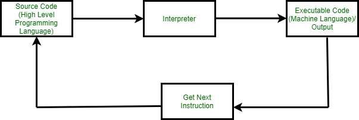

# Python Interpreter

**What is an Interpreter?**

       Interpreters we can call it as a translator. Interpreters are the computer program that will convert the source code or an high level language into intermediate code (machine level language). Interpreters executes each line of statements slowly. This process is called Interpretation. 

**How to install python interpreter?**

**Ans:**
    
    To install the python interpreter we can type the command as follows:

                       /usr/local/bin/python3

**How can we exit interpreter?**

**Ans:**

       We can exist the interpreter Typing an end-of-file character    
       (Control-D on Unix, Control-Z on Windows) at the primary prompt 
       causes the interpreter to exit with a zero exit status. 

       Or
       
       We can exit the interpreter by typing quit() command.

**Working Of an Interpreter is as follows:**
          
  

**Interpreters Function In Python:**

     In source code analysis, Python get source and check for some Indentation rule and check for errors. if there are any errors Python stops its execution and make to modify to prevent errors.

**Difference Between Interpreter and Compiler:**

    Interpreter: It Executes the programme line by line.
                 It is maximum used in Programming and development  
                 environment.
                 Python,Ruby,etc,. are the interpreted languages.

    Compiler: It Executes the whole programme.
              It is used in production environment.
              C,C++,Java are the compiled languages.

